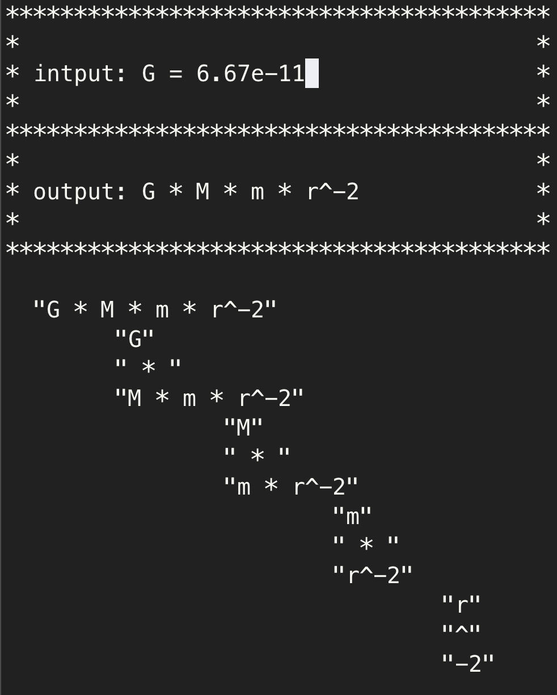

# symbolic
Symbolic calculator for arithmetic operations with fractions

## Update Log

### WIP
Consider the example:
f = a * x^2 + b * x^1 + c * x^0
x = 2
y = 3
g = y * f
==> 3 * a * 4 + 3 * b * 2 + 3 * c * 1
This happens because I haven't implemented commutative & associative rules.
Time to implement these properties.
We'll start with a simple strcmp and switching p->left and p->right.
Be careful that blindly doing it will make it commutative, not associative.
converting "y - x" into "-x - y" would not work well if x < 0. <- a mini project first.
	- the current version takes -x as an independent variable to x. <- another mini objective. if a new symbol starts with '-' but strtod doesn't read anything, then register it as "-1 * rest_of_string".

### WIP (resolved)
Consider the example:
(a * (x^2)) + ((b * (x^1)) + (c * (x^0)))
- x^1 should be replaced by x
- x^0 should be replaced by 1
- c * 1 should be replaced by c
Also the example:
a * x^2 + b * x + c
would not be parsed as expected but:
	a
	x^2 + b * x + c

### WHERE I TOOK OFF LAST TIME (resolved)
Updating parseExpr to make sure that DEFN_DIV and EQN_DIV are applied first with strstr, and then OP_DIV later with strstrmask with BLOCK_START and BLOCK_END.
The more I dig into the project, the more I realize that it take a lot of string parsing & editing work. It's not entirely reinventing the wheel because C doesn't assume it understands unspecified arguments as symbols, but the project is taking more time than I expected with the parsing work.
Also VAR should go back to SYMB. It makes more sense. Every variable is just a map { strings } -> { doubles }, a constant function.
In that sense, we can imagine having only one symbol tree for variable/function names. But then how do we accomodate the varying number of arguments for each symbol, and its formula expression?
One way is to limit the maximum number of arguments.
f = f(g, h) = g^2 + h^2;
	g = g(x, y) = x + y;
		x = 1.2;
		y = -3.4e-5;
	h = h(y, z) = y * z;
		y = -3.4e-5;
		z = NULL;
-> f = (1.2 + -3.4e-5)^2 + (-3.4e-5 * z)^2;
The project got streched out a little due to the ambitious initial goal, I'm splitting it into subgoals along with some clarified design & plan so that I can deliver it with measurable progress. I'll eventually merge the features, but splitting up into smaller projects will save this one-man-project at the moment.

1. Symbol tree
	1. Keep it
	2. For both variable names and function names, like the real-life f(x) = x^2 is recorded as "f"->"x^2".
	3. They are purely strings. Even for numeric assignment like "x = 5", the symbol tree will only serve it as a look-up dictionary, recording it as "x"->"5". The actual numerical evaluation will happen later.
	4. Add a command to flush it (free)
2. Expression parsing
	Split this into several mini-projects.
	1. Handle definition (" = ", ", "), formula evaluation, formula comparison (" == ", " > ", " >= ", " < ", " <= ", " != ") seperately.
	2. Register symbolic definition: Given an expression like "x = 5", addSym(SymbTree, "x", "5"). This applies to functions, like "f = (1 + 2 * x - y) * z" added as addSym(SymbTree, "f", "(1 + 2 * x - y) * z").
	3. Evaluate formula:
		To evaluate a given formula/expr (such as "(f + 1) / g(h)"), we first parse it as much as possiible to remove layers of symbols using SymbTree.
		1. Parsing
			Done as before, using strstrmask for (), [], and {}. (Note that we're not dealing with ", ", " = ", " == " stuffs here). At the end node p of each branch, we'll see p->op == NULL. there you run a look-up in SymbTree to see if you can parse more.
			if (p->op == NULL)
				updateExpr(p)	*look up SymbTree and update p->op, p->left, p->right as needed*
				parseExpr(p->left)
				parseExpr(p->right)
			When another expression is to be evaluated, free the previous expression tree to prevent memory leak.
		2. Actual evaluation.
			Evaluate numbers, apply symbolic operations if needed

### Updates (no longer maintained)
- Can accept symbolic variables with/without assigned values.
- Can display them in a fraction.

### Future Updates (no longer maintained)
- Can display current inputs.
- Can reduce fractions.
- Can apply values to variables for computation.
- Can display arithmetic operations ('+', '-', '\*', '/')
- Can scanf the "x = 1.2e-3" forms.
- Can parse line string inputs such as "G M m / r^2"
- Can parse equations of the form "F = G M m / r^2"
- Can reduce equations.

## Target Input Forms
- x = 5, y = 6
- f(x, y) = x^2 + y
- f(x, y) == g(x, y, z)
